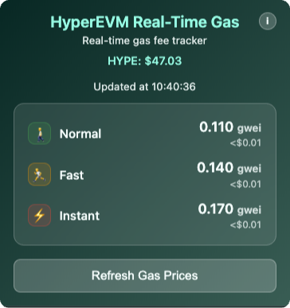

# HyperEVM Real-Time Gas

<div align="center">


**A privacy-focused browser extension for tracking real-time gas fees on the HyperEVM network**

[](https://chromewebstore.google.com/detail/hyperevm-real-time-gas/lbmelajajgmfmhfplcfhbgjlngmhbplm)
[](https://addons.mozilla.org/firefox)
[](https://github.com/Drarox/HyperEVM-Real-Time-Gas)

</div>

## 🚀 Features

- **Real-time Gas Prices**: Live gas price tracking from HyperEVM network
- **Three Speed Tiers**: Normal 🚶, Fast 🏃, and Instant ⚡ gas options
- **USD Cost Estimates**: See transaction costs in USD using live HYPE token prices
- **Beautiful UI**: Clean, modern interface with HyperEVM branding
- **Privacy-First**: No tracking, minimal permissions, works completely offline
- **Lightweight**: Fast and efficient with smart caching
- **Auto-refresh**: Background updates every minute with rate limiting

## 📸 Preview
*Extension Icon with real-time gwei updates:*


*Extension Popup:*




## 🔧 Installation

### Chrome Web Store (Chrome, Edge, Brave, Opera, etc.)
[](https://chromewebstore.google.com/detail/hyperevm-real-time-gas/lbmelajajgmfmhfplcfhbgjlngmhbplm)

### Firefox Add-ons (Soon)
[](https://addons.mozilla.org/firefox)

### Manual Installation (Developer Mode)

1. **Download**: Clone or download this repository
   ```bash
   git clone https://github.com/Drarox/HyperEVM-Real-Time-Gas.git
   ```

2. **Chromium-based browsers**:
   - Open `chrome://extensions/`
   - Enable "Developer mode"
   - Click "Load unpacked"
   - Select the extension folder

3. **Firefox**:
   - Open `about:debugging`
   - Click "This Firefox"
   - Click "Load Temporary Add-on"
   - Select the `manifest.json` file

## 🎯 How It Works

The extension connects directly to the HyperEVM RPC endpoint to fetch real-time gas prices and displays them in three tiers:

- **🚶 Normal**: Current network gas price (base fee)
- **🏃 Fast**: Base price + 25% premium for faster confirmation
- **⚡ Instant**: Base price + 50% premium for immediate confirmation

USD costs are calculated using live HYPE token prices from CoinGecko API with smart caching to respect rate limits.

## 🔒 Privacy & Security

### Minimal Permissions
- **`storage`**: Store gas price data locally
- **`alarms`**: Schedule background updates
- **No tracking permissions**: We don't collect any personal data

### Privacy-First Design
- ✅ **No user tracking** or analytics
- ✅ **No personal data collection**
- ✅ **Local data storage only**
- ✅ **Open source** and auditable
- ✅ **Minimal API calls** with smart caching

### Network Requests
The extension only makes requests to:
- `https://rpc.hyperliquid.xyz/evm` - HyperEVM RPC for gas prices
- `https://api.coingecko.com/api/v3/simple/price` - HYPE token price (cached for 60 seconds)

## 🏗️ Technical Details

### Gas Price Calculation
```javascript
// Formula for USD cost estimation
const gasLimit = 46000; // Standard ERC20 token transfer
const costInHype = (gasPriceGwei * gasLimit) / 1000000000;
const costInUsd = costInHype * hypePrice;
```

### Caching Strategy
- Gas prices: Updated every 5 seconds via Chrome alarms
- HYPE price: Cached for 60 seconds to respect API limits
- Local storage: Persistent across browser sessions

## 🤝 Contributing

We welcome contributions! Here's how you can help:

### 🐛 Bug Reports
Found a bug? Please [open an issue](https://github.com/Drarox/HyperEVM-Real-Time-Gas/issues) with:
- Browser version and OS
- Steps to reproduce
- Expected vs actual behavior
- Screenshots if applicable

### 💡 Feature Requests
Have an idea? [Create a feature request](https://github.com/Drarox/HyperEVM-Real-Time-Gas/issues) with:
- Clear description of the feature
- Use case and benefits
- Any implementation ideas

### 🔧 Development Setup

1. **Fork** the repository
2. **Clone** your fork:
   ```bash
   git clone https://github.com/yourusername/HyperEVM-Real-Time-Gas.git
   ```
3. **Make changes** and test locally
4. **Submit** a pull request with:
   - Clear description of changes
   - Screenshots for UI changes
   - Test results


## 📄 License

This project is licensed under the GPL-3.0 License - see the [LICENSE](LICENSE) file for details.

## 🙏 Acknowledgments

- [HyperEVM](https://hyperliquid.xyz/) for the amazing network
- [CoinGecko](https://coingecko.com/) for price data API
- The open-source community for inspiration and tools

---

<div align="center">

**⭐ Star this repo if you find it helpful!**

Made with ❤️ for the HyperEVM community

</div>